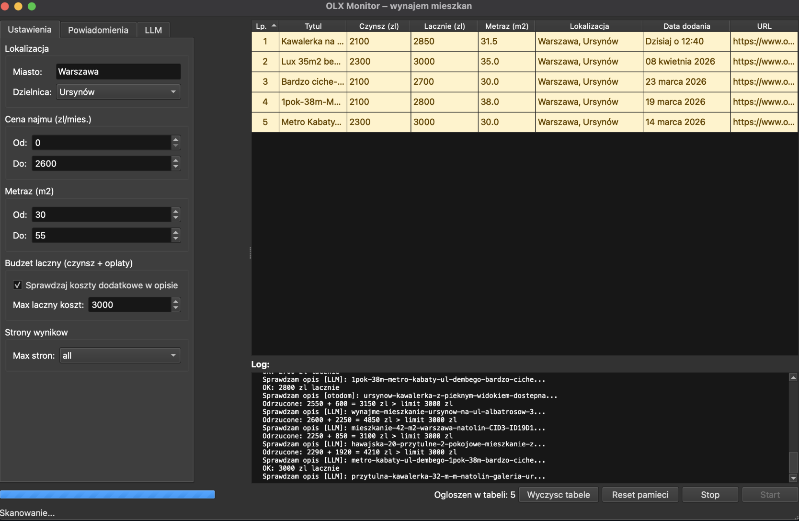
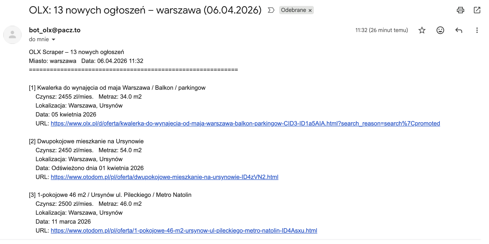

[](https://github.com/mar0ls/olx-monitor/actions/workflows/tests.yml)

[](https://github.com/mar0ls/olx-monitor/releases/latest)


# OLX Monitor

> **Polish apartment rental monitor for [OLX.pl](https://www.olx.pl).**  
> Filters listings by price, area and total monthly cost (rent + extra fees), sends alerts via iMessage, e-mail or a text file. Runs as a CLI tool or a PyQt6 desktop GUI.  
> *Documentation below is in Polish — the target audience and service are Polish-language.*


---

# OLX Monitor

Monitor ogłoszeń o wynajmie mieszkań z OLX.pl z powiadomieniami przez iMessage, e-mail lub zapis do pliku. Działa w trybie CLI (terminal) i GUI (aplikacja desktopowa PyQt6).

## Funkcje

- Przeszukuje wiele stron wyników OLX z filtrami ceny i metrażu
- Wykrywa dodatkowe koszty (czynsz administracyjny, media, rachunki) w opisie ogłoszenia i liczy **łączny koszt miesięczny**
- Opcjonalnie ocenia ogłoszenia przez AI: wynik 0-100, klasyfikacja, krótkie uzasadnienie i ryzyko ukrytych kosztów
- Zapamiętuje już widziane ogłoszenia — przy kolejnym uruchomieniu pomija duplikaty
- Powiadamia przez **iMessage/SMS** (macOS) — osobny alert na każde ogłoszenie, **e-mail SMTP** — jeden zbiorczy po zakończeniu skanowania, lub **zapis do pliku TXT**
- Tryb ciągły z konfigurowalnym interwałem (`--interval`)
- Graficzny interfejs użytkownika z sortowaniem wyników, filtrowaniem i logiem skanowania

## Wymagania

- Python 3.11+
- macOS (iMessage), lub dowolny system (e-mail / plik)

## Instalacja

```bash
# Sklonuj repozytorium
git clone https://github.com/mar0ls/olx-monitor.git
cd olx-monitor

# Utwórz i aktywuj środowisko wirtualne
python3 -m venv venv
source venv/bin/activate

# Zainstaluj zależności
pip install -r requirements.txt
```

## Użycie

### CLI (terminal)

Przed uruchomieniem ustaw parametry wyszukiwania w sekcji `CONFIG` na początku [olx_scraper.py](olx_scraper.py):

```python
CONFIG = {
    "miasto":         "warszawa",   # lub "krakow", "wroclaw", "gdansk" itd.
    "district_id":    373,          # opcjonalnie: ID dzielnicy (None = całe miasto)
    "cena_min":       2000,         # PLN/miesiąc
    "cena_max":       4500,
    "metraz_min":     35,           # m²
    "metraz_max":     70,
    "budzet_lacznie": 5000,         # max łączny koszt (None = wyłączone)
    "max_stron":      3,            # lub "all"
    "imessage_numer": "+48600000000",
    "wyslij_imessage": True,
    # "seen_file":     "/pelna/sciezka/do/.olx_scraper_seen.json",  # opcjonalnie
}
```

Jeśli nie ustawisz `seen_file`, aplikacja domyślnie użyje wspólnego pliku:
`~/.olx_scraper_seen.json`.

Zamiast numeru `district_id` można wpisać nazwę dzielnicy jako `"dzielnica": "mokotow"` — scraper zamieni ją na odpowiedni ID automatycznie.

```bash
# Jednorazowe skanowanie
python olx_scraper.py

# Skanowanie co 6 godzin
python olx_scraper.py --interval 21600

# Wyczyść pamięć (zacznij od nowa)
python olx_scraper.py --reset

# Szczegółowe logi (debug)
python olx_scraper.py --debug
```

### GUI (aplikacja desktopowa)

```bash
python olx_gui.py
```

Okno podzielone na dwie części:
- **Lewa strona** – zakładki: *Ustawienia* (miasto, cena, metraż), *Powiadomienia* (iMessage, e-mail, plik), *LLM* (Ollama lub OpenAI API)
- **Prawa strona** – tabela wyników z sortowaniem, kolumną **AI**, szybkimi filtrami i logiem skanowania

Podwójne kliknięcie w wiersz tabeli otwiera ogłoszenie w przeglądarce.  
Wybrany wiersz (lub kilka) można usunąć klawiszem **Delete** albo przez **prawy przycisk myszy → Usuń zaznaczone wiersze**.

Kolumna **AI** pokazuje ocenę 0-100. Po najechaniu kursorem widać krótkie uzasadnienie, plusy, ryzyka i poziom ryzyka ukrytych kosztów.
Nad tabelą dostępne są szybkie filtry: wyszukiwanie tekstowe, minimalny próg AI, werdykt modelu i opcja pokazywania tylko ocenionych ogłoszeń.
Pod filtrami widoczne jest krótkie podsumowanie aktywnego widoku: liczba ogłoszeń, liczba ocenionych, shortlista (`AI >= 80`) i liczba ofert z wysokim ryzykiem kosztów.



**Kolorowanie wierszy:**

| Kolor | Znaczenie | Tooltip po najechaniu |
|-------|-----------|----------------------|
| Żółty | Wykryto dodatkowe opłaty w opisie (czynsz administracyjny, media itp.) — kolumna *Łącznie* pokazuje sumę | Szczegóły: jakie opłaty i po ile |
| Pomarańczowy | Ogłoszenie pochodzi z **otodom.pl** — parser nie zwrócił danych (brak opisu i czynszu), rzeczywisty koszt nieznany | Wyjaśnienie, dlaczego weryfikacja nie była możliwa |
| Niebieski | Ogłoszenie z OLX ma sygnały kosztowe wymagające ostrożności: brak jednoznacznych kwot albo koszty zależne od zużycia | Konkretne sygnały z opisu i sugestia dalszej weryfikacji |
| Brak koloru | Cena kompletna lub opłaty wliczone w cenę | — |

> Najedź kursorem myszy na dowolny podświetlony wiersz, aby zobaczyć szczegółowe wyjaśnienie.

### Przykład powiadomień e-mail



## Obsługiwane miasta i dzielnice

Scraper zawiera wbudowaną mapę `district_id` dla 12 polskich miast (kwiecień 2026).
W GUI dzielnica wybierana jest z listy rozwijanej wypełnianej automatycznie po wpisaniu miasta.
Dla miast bez filtrów dzielnic na OLX (Bydgoszcz, Lublin, Radom, Rzeszów, Toruń, Kielce, Opole, Olsztyn, Zielona Góra) scraper przeszukuje całe miasto.

| Miasto | Klucz URL | Liczba dzielnic |
|--------|-----------|----------------|
| Warszawa | `warszawa` | 18 |
| Kraków | `krakow` | 18 |
| Wrocław | `wroclaw` | 6 |
| Poznań | `poznan` | 28 |
| Gdańsk | `gdansk` | 30 |
| Gdynia | `gdynia` | 22 |
| Sopot | `sopot` | 3 |
| Łódź | `lodz` | 5 |
| Katowice | `katowice` | 21 |
| Szczecin | `szczecin` | 16 |
| Białystok | `bialystok` | 28 |
| Częstochowa | `czestochowa` | 19 |

### Przykłady district_id (Warszawa)

| Dzielnica | district_id |
|-----------|------------|
| Ursynów | 373 |
| Mokotów | 353 |
| Śródmieście | 351 |
| Wola | 359 |
| Ochota | 355 |
| Żoliborz | 363 |
| Praga-Południe | 381 |
| Bemowo | 367 |
| Białołęka | 365 |

Aby znaleźć ID dzielnicy dla innego miasta ręcznie: otwórz OLX, wybierz dzielnicę w filtrach i skopiuj wartość parametru `search[district_id]` z URL.

## LLM i ocena AI

W zakładce **LLM** można:

- przełączyć analizę kosztów z wyrażeń regularnych na model językowy,
- włączyć **ocenę AI ogłoszeń** z wynikiem 0-100,
- podać własne **priorytety najemcy** (np. *balkon, metro, cicha okolica*), które model uwzględni przy scoringu.

Do wyboru są dwa dostawcy: lokalny **Ollama** lub **OpenAI API**.

### Konfiguracja

| Pole | Opis |
|------|------|
| Checkbox "Używaj LLM..." | Włącza LLM do analizy kosztów zamiast regex |
| Checkbox "Oceniaj ogłoszenia przez AI" | Dodaje ocenę 0-100 i krótkie uzasadnienie do każdego ogłoszenia |
| Priorytety | Opcjonalny opis tego, na czym zależy Ci najbardziej |
| Dostawca | **Ollama (lokalny)** lub **OpenAI API** |
| URL Ollamy | Adres serwera Ollamy, domyślnie `http://localhost:11434` |
| Model (Ollama) | Wybierz z listy (przycisk "Odśwież") lub wpisz ręcznie |
| Klucz API (OpenAI) | Klucz z [platform.openai.com](https://platform.openai.com) |
| Model (OpenAI) | Domyślnie: `gpt-4o-mini`, `gpt-4.1-mini`, `gpt-4o` |
| Test połączenia | Sprawdza połączenie z wybranym dostawcą |

### Ollama (lokalny, bez kosztów)

```bash
# Zainstaluj Ollamę (macOS)
brew install ollama

# Uruchom serwer
ollama serve

# Pobierz model (wybierz jeden)
ollama pull llama3
ollama pull mistral
ollama pull SpeakLeash/bielik-11b-v3.0-instruct:Q5_K_M
```

### Co robi ocena AI?

Model ocenia m.in.:

- relację **cena / metraż**,
- kompletność i wiarygodność opisu,
- ryzyko **ukrytych kosztów**,
- czerwone flagi typu brak konkretów, niepełne koszty, zbyt lakoniczny opis,
- zgodność z Twoimi priorytetami.

Ocena AI nie zastępuje twardych filtrów. Ma pomóc szybciej ustalić, które oferty warto sprawdzić najpierw.

### OpenAI API

Podaj klucz API w polu **Klucz API**. Domyślny model `gpt-4o-mini` zwykle wystarcza do analizy kosztów i scoringu ogłoszeń.

### Zalety i ograniczenia

| | Regex | Ollama | OpenAI API |
|-|-------|--------|------------|
| Szybkość | < 0.1s/ogłoszenie | 1–5s/ogłoszenie | 0.5–2s/ogłoszenie |
| Standardowe formaty | ✅ | ✅ | ✅ |
| Niestandardowe opisy | ❌ | ✅ | ✅ |
| Działa bez internetu | ✅ | ✅ | ❌ |
| Koszt | bezpłatny | bezpłatny | płatny (ułamki gr/ogłoszenie) |
| Wymaga konfiguracji | ❌ | Ollama | Klucz API |

Ogłoszenia z **otodom.pl** są zawsze analizowane osobnym parserem (`otodom_scraper.py`), który odczytuje dane z JSON-a wbudowanego w stronę Next.js — niezależnie od ustawienia LLM.

Jeśli wybrany LLM jest niedostępny podczas skanowania, program automatycznie wraca do regex bez przerywania pracy.

## Jak działa analiza dodatkowych kosztów (regex)

Gdy włączony jest filtr **budżetu łącznego**, scraper dla każdego ogłoszenia spełniającego ceny:

1. Pobiera stronę ogłoszenia i wyciąga opis
2. Sprawdza, czy opis zawiera frazy typu *"wszystko w cenie"*, *"media wliczone"* → jeśli tak, extra = 0 zł
3. W przeciwnym razie szuka kwot przy słowach kluczowych: *czynsz administracyjny*, *media*, *rachunki*, *c.o.*, *opłaty eksploatacyjne* itd.
4. Dla zakresów (np. *"rachunki 200–400 zł"*) przyjmuje pesymistycznie wyższą wartość
5. Odrzuca ogłoszenie jeśli `cena + extra > budzet_lacznie`

## Struktura projektu

```
olx_scraper.py      – silnik monitora (logika, parsowanie, powiadomienia)
otodom_scraper.py   – parser ogłoszeń otodom.pl (Next.js __NEXT_DATA__)
olx_gui.py          – interfejs graficzny PyQt6
miner_id.py         – narzędzie do podglądu district_id dla wybranego miasta
test_olx_scraper.py – testy jednostkowe (pytest)
requirements.txt    – zależności Python
.gitignore          – pliki wykluczone z repozytorium
```

## Uruchomienie testów i lintu

```bash
pip install -r requirements.txt
pip install -r requirements-dev.txt

pytest -q
ruff check .
```

## Lokalna kompilacja

Projekt ma dwa tryby budowania:

1. build developerski przez `spec`, przydatny do lokalnego testowania bundla `.app` na macOS,
2. build release-like, który tworzy pojedynczy artefakt do dystrybucji.

### Build developerski

```bash
venv/bin/pyinstaller olx-monitor.spec --noconfirm
```

Artefakty pojawią się w katalogu `dist/`:

- `dist/olx-monitor` — katalog pomocniczy `PyInstaller` w trybie `onedir`
- `dist/olx-monitor.app` — pakiet `.app` dla macOS

Ten tryb jest wygodny do debugowania lokalnego bundla, ale nie jest najlepszy do publikacji, bo zostawia pełny katalog roboczy.

### Build release-like

```bash
bash scripts/build_release.sh
```

Gotowy artefakt pojawi się w `dist/release/`:

- macOS: `dist/release/olx-monitor-macos.zip`
- Linux: `dist/release/olx-monitor-linux`
- Windows: `dist/release/olx-monitor-windows.exe`

Na macOS skrypt pakuje gotowe `olx-monitor.app` do pojedynczego archiwum ZIP, więc lokalny wynik wygląda tak samo jak artefakt do publikacji.

Testy pokrywają:

| Moduł | Co testuje |
|-------|-----------|
| `build_url` | budowanie URL, filtr district_id, rozpoznawanie nazwy dzielnicy |
| `get_districts_for_city` | mapa dzielnic, normalizacja polskich znaków |
| `parse_price` | parsowanie cen (zł, PLN, różne formaty) |
| `parse_metraz` | parsowanie metrażu (m², m2, przecinki) |
| `parse_listings` | parsowanie kart ogłoszeń z HTML |
| `extract_extra_costs` | wykrywanie i sumowanie dodatkowych kosztów |
| `has_next_page` | wykrywanie paginacji |
| `load_seen` / `save_seen` | trwałość danych (JSON) |
| `format_imessage` | formatowanie powiadomień |
| `fetch_page` / `fetch_detail` | pobieranie stron (mock HTTP) |
| `extract_extra_costs_llm` | analiza kosztów przez LLM (mock Ollama) |
| `extract_extra_costs_openai` | analiza kosztów przez OpenAI API (mock HTTP) |
| `analyze_listing_with_ai` | scoring AI ogłoszeń i normalizacja odpowiedzi modelu |
| `fetch_ollama_models` | pobieranie listy modeli Ollamy (mock HTTP) |
| `otodom_scraper` | parsowanie __NEXT_DATA__ z otodom.pl (mock HTTP) |

## Trwałość danych i bezpieczeństwo

- Numer telefonu i treść wiadomości są escapowane przed wstawieniem do skryptu AppleScript (ochrona przed injection)
- Hasło SMTP nie jest zapisywane do pliku konfiguracyjnego
- CLI i GUI współdzielą jeden plik pamięci widzianych ogłoszeń: `.olx_scraper_seen.json`
- Pliki `.olx_scraper_seen.json` i `.olx_scraper_gui.json` są wykluczone z gita (`.gitignore`)

## Konfiguracja e-mail (SMTP)

### Gmail

Od maja 2022 Gmail **nie pozwala logować się przez SMTP zwykłym hasłem konta** — wymagane jest **Hasło aplikacji** (App Password).

**Warunek:** konto Google musi mieć włączoną weryfikację dwuetapową (2FA).

1. Przejdź na stronę [myaccount.google.com/apppasswords](https://myaccount.google.com/apppasswords)
2. Wybierz aplikację: **Poczta**, urządzenie: **Komputer Mac** (lub dowolne)
3. Kliknij **Generuj** → skopiuj wyświetlone 16-znakowe hasło (np. `abcd efgh ijkl mnop`)
4. Wpisz to hasło (bez spacji) w polu **Hasło** w zakładce *Powiadomienia → E-mail (SMTP)*

> **Jeśli pojawia się komunikat „The setting you are looking for is not available for your account":**  
> Konto jest kontem Google Workspace (firmowym/szkolnym) — administrator domeny wyłączył hasła aplikacji.  
> Użyj jednej z alternatyw poniżej.

### Outlook / Hotmail (zalecana alternatywa)

Konta Microsoft (`@outlook.com`, `@hotmail.com`) obsługują SMTP zwykłym hasłem bez dodatkowej konfiguracji.

| Pole | Wartość |
|------|---------|
| Serwer | `smtp-mail.outlook.com` |
| Port | `587` |
| Login | `twój@outlook.com` |
| Hasło | zwykłe hasło konta Microsoft |
| Do | adres odbiorcy powiadomień |

### Interia / pacz.to / op.pl i inne serwisy Grupy Interia

Interia **domyślnie blokuje dostęp SMTP** z zewnętrznych programów. Przed pierwszym użyciem należy to ręcznie włączyć:

1. Zaloguj się przez webmail: [poczta.interia.pl](https://poczta.interia.pl)
2. Kliknij ikonę **lub menu ⚙ Ustawienia**
3. Przejdź do **Ustawienia konta → Główne ustawienia → Parametry → Programy pocztowe** ( *Dostęp przez zewnętrzne programy*)
4. Włącz opcję **„Korzystam z programu do obsługi poczty”** i zapisz

Po włączeniu wpisz w GUI:

| Pole | Wartość |
|------|----------|
| Serwer | `poczta.interia.pl` |
| Port | `587` |
| Login | pełny adres e-mail (np. `bot@pacz.to`) |
| Hasło | zwykłe hasło konta |
| Do | adres odbiorcy powiadomień |

> Ta sama procedura dotyczy kont `@interia.pl`, `@interia.eu`, `@poczta.fm`, `@op.pl`, `@vp.pl`, `@pacz.to` i innych domen Grupy Interia.

### Przegląd dostawców SMTP

| Dostawca | Serwer | Port | Hasło | Wymaga aktywacji |
|----------|--------|------|-------|------------------|
| Gmail | `smtp.gmail.com` | `587` | hasło aplikacji (App Password) | 2FA + App Password |
| Outlook/Hotmail | `smtp-mail.outlook.com` | `587` | zwykłe hasło konta | nie |
| Interia i pochodne | `poczta.interia.pl` | `587` | zwykłe hasło konta | **tak** – patrz sekcja wyżej |
| iCloud | `smtp.mail.me.com` | `587` | hasło aplikacji z [appleid.apple.com](https://appleid.apple.com) | App Password |
| Własny hosting | wg. dostawcy | `587` / `465` | wg. dostawcy | wg. dostawcy |

> **Port 465** = SSL/TLS — niektóre serwery hostingowe  
> **Port 587** = STARTTLS — Gmail, Outlook, Interia i większość dostawców  
> Aplikacja wykrywa tryb połączenia automatycznie na podstawie numeru portu.

## Uruchamianie skompilowanej wersji

Pobierz plik wykonywalny ze strony [Releases](../../releases) dla swojego systemu:

| System | Plik |
|--------|------|
| macOS | `olx-monitor-macos.zip` |
| Linux | `olx-monitor-linux` |
| Windows | `olx-monitor-windows.exe` |

> Po pobraniu wersji dla macOS rozpakuj archiwum i uruchom `olx-monitor.app`.
>
> **Pierwsze uruchomienie trwa kilka sekund dłużej** głównie przy buildach jednoplikowych dla Linux i Windows, bo aplikacja rozpakowuje się do katalogu tymczasowego. Kolejne starty są szybsze dopóki katalog tymczasowy nie zostanie wyczyszczony.

Na macOS może pojawić się ostrzeżenie o nieznanym deweloperze — przejdź do *Preferencje systemowe → Prywatność i bezpieczeństwo* i kliknij **Otwórz mimo to**.

## Znane ograniczenia

- OLX może zmienić strukturę HTML — w razie braku wyników sprawdź selektory w `parse_listings()` i `fetch_detail()`
- iMessage dostępny tylko na macOS z uruchomioną aplikacją Wiadomości
- Ogłoszenia z serwisu **Otodom** (pojawiające się w wynikach OLX) są obsługiwane przez osobny parser (`otodom_scraper.py`). Jeśli otodom nie zwróci danych (zmiana struktury strony), wiersz jest oznaczany pomarańczowo z tooltipem z wyjaśnieniem

## E-mail na Linux i Windows

Mechanizm e-mail (`smtplib`) korzysta wyłącznie ze standardowej biblioteki Pythona i **działa identycznie na macOS, Linux i Windows** — nie wymaga żadnych dodatkowych zależności systemowych. Jedyna funkcja specyficzna dla macOS to iMessage (AppleScript) — na Linux/Windows po prostu się nie uruchomi (bez błędu krytycznego).

## Zgodność z regulaminem OLX

Scraper pobiera **publiczne strony wyników wyszukiwania** (takie same jak te, które widzi przeglądarka).  
Zachowuje rozsądne opóźnienia między żądaniami (2 s między stronami, 1 s między ogłoszeniami).

Plik [`robots.txt`](https://www.olx.pl/robots.txt) OLX **nie blokuje** ścieżek wyników wyszukiwania — `Allow: /` obejmuje strony listingów.  
Blokowane są jedynie: `/api/` (z wyjątkami), panele administracyjne, formularze kontaktowe i drukowanie.

> **Uwaga:** Scraper jest narzędziem do **osobistego monitorowania ogłoszeń** z częstotliwością porównywalną do ręcznego przeglądania. Nie jest przeznaczony do masowego pobierania danych, tworzenia konkurencyjnych serwisów ani agregacji ogłoszeń. Używaj odpowiedzialnie i z poszanowaniem infrastruktury OLX.

## Współpraca

Pull requesty są mile widziane.  
Jeśli chcesz dodać nową funkcję lub poprawić istniejącą, przygotuj fork, branch i PR.  
Przed wysłaniem upewnij się, że testy i lint przechodzą (`venv/bin/pytest -q` oraz `venv/bin/ruff check .`).

## Licencja

Projekt udostępniony na licencji **MIT** — patrz plik [LICENSE](LICENSE).
