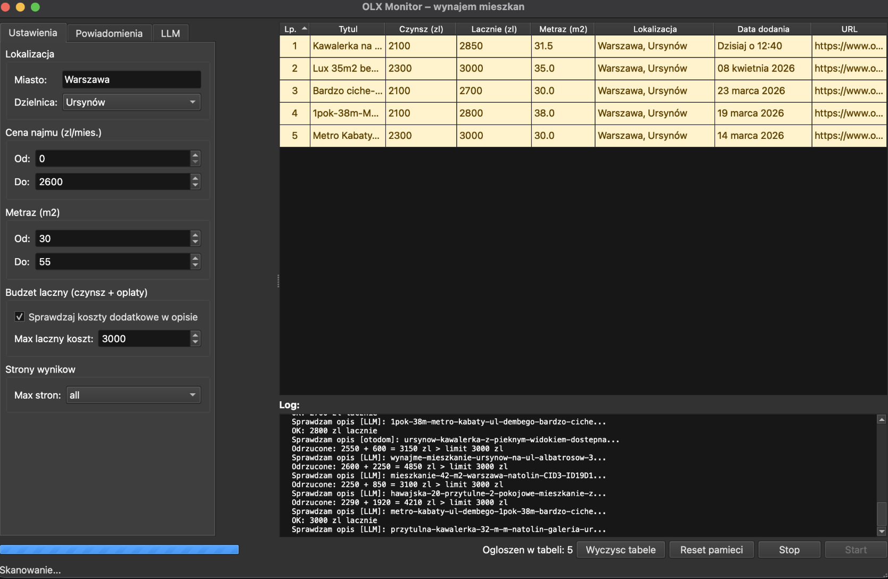
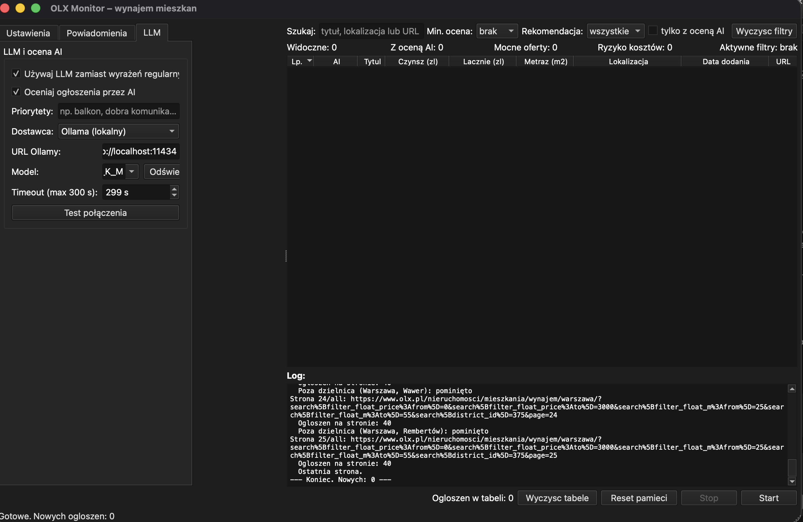

[](https://github.com/mar0ls/olx-monitor/actions/workflows/tests.yml)

[](https://github.com/mar0ls/olx-monitor/releases/latest)


# OLX Monitor

> **Polish apartment rental monitor for [OLX.pl](https://www.olx.pl).**  
> Filters listings by price, area and total monthly cost (rent + extra fees), sends alerts via iMessage, e-mail or a text file. Runs as a CLI tool or a PyQt6 desktop GUI.

---

Apartment rental listing monitor for OLX.pl with notifications via iMessage, e-mail, or file output. Works in CLI (terminal) and GUI (PyQt6 desktop app) modes.

## Features

- Scans multiple OLX result pages with price and area filters
- Detects additional costs (administrative fee, utilities, bills) in listing descriptions and calculates the **total monthly cost**
- Optionally evaluates listings with AI: score 0–100, classification, short explanation, and hidden-cost risk
- Remembers previously seen listings — skips duplicates on subsequent runs
- Sends notifications via **iMessage/SMS** (macOS) — one alert per listing, **SMTP e-mail** — one summary after the scan, or **TXT file export**
- Continuous monitoring mode with configurable interval (`--interval`)
- Desktop GUI with result sorting, filtering, and a scan log

## Requirements

- Python 3.11+
- macOS (for iMessage), or any OS (for e-mail / file output)

## Installation

```bash
# Clone the repository
git clone https://github.com/mar0ls/olx-monitor.git
cd olx-monitor

# Create and activate a virtual environment
python3 -m venv venv
source venv/bin/activate

# Install dependencies
pip install -r requirements.txt
```

## Usage

### CLI (terminal)

Before running, set your search parameters in the `CONFIG` section at the top of [olx_scraper.py](olx_scraper.py):

```python
CONFIG = {
    "miasto":         "warszawa",   # or "krakow", "wroclaw", "gdansk", etc.
    "district_id":    373,          # optional: district ID (None = whole city)
    "cena_min":       2000,         # PLN/month
    "cena_max":       4500,
    "metraz_min":     35,           # m²
    "metraz_max":     70,
    "budzet_lacznie": 5000,         # max total cost (None = disabled)
    "max_stron":      3,            # or "all"
    "imessage_numer": "+48600000000",
    "wyslij_imessage": True,
    # "seen_file":     "/full/path/to/.olx_scraper_seen.json",  # optional
}
```

If `seen_file` is not set, the app defaults to a shared file at `~/.olx_scraper_seen.json`.

Instead of a numeric `district_id` you can use a district name via `"dzielnica": "mokotow"` — the scraper resolves it to the correct ID automatically.

```bash
# One-time scan
python olx_scraper.py

# Scan every 6 hours
python olx_scraper.py --interval 21600

# Clear memory (start fresh)
python olx_scraper.py --reset

# Verbose output (debug)
python olx_scraper.py --debug
```

### GUI (desktop app)

```bash
python olx_gui.py
```

The window is split into two panels:
- **Left panel** — tabs: *Settings* (city, price, area), *Notifications* (iMessage, e-mail, file), *LLM* (Ollama or OpenAI API)
- **Right panel** — results table with sorting, an **AI** column, quick filters, and a scan log

Double-clicking a row opens the listing in a browser.  
Selected rows can be removed with the **Delete** key or via **right-click → Remove selected rows**.

The **AI** column shows a score from 0–100. Hovering shows a short explanation, pros, risks, and hidden-cost risk level.  
Quick filters above the table include text search, minimum AI threshold, model verdict, and a toggle to show only scored listings.  
Below the filters a summary bar shows the number of listings, scored count, shortlist (`AI >= 80`), and high-cost-risk count.





**Row highlighting:**

| Color | Meaning | Tooltip on hover |
|-------|---------|-----------------|
| Yellow | Additional fees detected in the description (admin fee, utilities, etc.) — the *Total* column shows the sum | Details: which fees and amounts |
| Orange | Listing is from **otodom.pl** — parser returned no data (no description or rent), actual cost unknown | Explanation of why verification was not possible |
| Blue | OLX listing has cost signals requiring caution: no concrete amounts or usage-dependent costs | Specific signals from the description and a suggestion to verify further |
| No color | Price is complete or fees are included | — |

> Hover over any highlighted row to see a detailed explanation.

### Docker

Copy the example env file and edit as needed, then use `make` to manage the container:

```bash
cp docker/.env.example .env
# edit .env: set SCAN_INTERVAL, OLLAMA_URL, etc.
```

```bash
make build          # build the Docker image
make up             # start in the background (auto-restart on reboot)
make logs           # follow live logs
make run            # single scan and exit (no loop)
make rerun          # rebuild image and restart the container
make shell          # open a bash shell inside the container
make down           # stop and remove the container (keeps data volume)
make clean          # stop and remove everything including the seen-listings volume
```

To override the scan interval without editing `.env`:

```bash
SCAN_INTERVAL=3600 docker compose up -d scraper   # scan every hour
```

To start the optional Ollama sidecar alongside the scraper:

```bash
make up-ollama      # starts scraper + ollama
make down-ollama    # stops both
```

### E-mail notification example


## Supported cities and districts

The scraper has a built-in `district_id` map for 12 Polish cities (April 2026).  
In the GUI, districts are selected from a dropdown that populates automatically when you type a city name.  
Cities without district filters on OLX (Bydgoszcz, Lublin, Radom, Rzeszów, Toruń, Kielce, Opole, Olsztyn, Zielona Góra) are scanned as a whole.

| City | URL key | Districts |
|------|---------|-----------|
| Warsaw | `warszawa` | 18 |
| Kraków | `krakow` | 18 |
| Wrocław | `wroclaw` | 6 |
| Poznań | `poznan` | 28 |
| Gdańsk | `gdansk` | 30 |
| Gdynia | `gdynia` | 22 |
| Sopot | `sopot` | 3 |
| Łódź | `lodz` | 5 |
| Katowice | `katowice` | 21 |
| Szczecin | `szczecin` | 16 |
| Białystok | `bialystok` | 28 |
| Częstochowa | `czestochowa` | 19 |

### district_id examples (Warsaw)

| District | district_id |
|----------|------------|
| Ursynów | 373 |
| Mokotów | 353 |
| Śródmieście | 351 |
| Wola | 359 |
| Ochota | 355 |
| Żoliborz | 363 |
| Praga-Południe | 381 |
| Bemowo | 367 |
| Białołęka | 365 |

To find a district ID manually: open OLX, select a district in the filters, and copy the `search[district_id]` parameter value from the URL.

## LLM and AI evaluation

In the **LLM** tab you can:

- switch cost analysis from regex to a language model,
- enable **AI listing scoring** with a 0–100 result,
- provide your own **tenant priorities** (e.g. *balcony, metro nearby, quiet area*) that the model will factor into scoring.

Two providers are available: local **Ollama** or **OpenAI API**.

### Configuration

| Field | Description |
|-------|-------------|
| "Use LLM..." checkbox | Enables LLM for cost analysis instead of regex |
| "Score listings with AI" checkbox | Adds a 0–100 score and short explanation to each listing |
| Priorities | Optional description of what matters most to you |
| Provider | **Ollama (local)** or **OpenAI API** |
| Ollama URL | Ollama server address, default `http://localhost:11434` |
| Model (Ollama) | Pick from the list (Refresh button) or type manually |
| API Key (OpenAI) | Key from [platform.openai.com](https://platform.openai.com) |
| Model (OpenAI) | Default: `gpt-4o-mini`, `gpt-4.1-mini`, `gpt-4o` |
| Test connection | Verifies connectivity to the selected provider |

### Ollama (local, free)

```bash
# Install Ollama (macOS)
brew install ollama

# Start the server
ollama serve

# Pull a model (pick one)
ollama pull llama3
ollama pull mistral
ollama pull SpeakLeash/bielik-11b-v3.0-instruct:Q5_K_M
```

### What does AI scoring do?

The model evaluates, among other things:

- **price / area** ratio,
- completeness and credibility of the description,
- **hidden-cost** risk,
- red flags such as vague descriptions, incomplete costs, or overly brief text,
- match with your stated priorities.

AI scoring supplements hard filters — it helps you decide which listings to check first.

### OpenAI API

Enter your API key in the **API Key** field. The default model `gpt-4o-mini` is usually sufficient for cost analysis and listing scoring.

### Comparison

| | Regex | Ollama | OpenAI API |
|-|-------|--------|------------|
| Speed | < 0.1s/listing | 1–5s/listing | 0.5–2s/listing |
| Standard formats | ✅ | ✅ | ✅ |
| Non-standard descriptions | ❌ | ✅ | ✅ |
| Works offline | ✅ | ✅ | ❌ |
| Cost | free | free | paid (fractions of a cent/listing) |
| Requires setup | ❌ | Ollama | API key |

Listings from **otodom.pl** are always parsed by a dedicated parser (`otodom_scraper.py`) that reads data from the Next.js `__NEXT_DATA__` JSON embedded in the page — regardless of the LLM setting.

If the selected LLM is unavailable during a scan, the app automatically falls back to regex without interrupting the run.

## How extra-cost analysis works (regex)

When the **total budget** filter is enabled, the scraper processes each listing that passes price filters:

1. Fetches the listing page and extracts the description
2. Checks for phrases like *"all inclusive"*, *"utilities included"* → if found, extra = 0 PLN
3. Otherwise searches for amounts next to keywords: *administrative fee*, *utilities*, *bills*, *central heating*, *service charges*, etc.
4. For ranges (e.g. *"bills 200–400 PLN"*) the higher value is used pessimistically
5. Rejects the listing if `price + extra > total_budget`

## Project structure

```
olx_scraper.py        – monitor engine (logic, parsing, notifications)
otodom_scraper.py     – otodom.pl listing parser (Next.js __NEXT_DATA__)
olx_gui.py            – PyQt6 graphical interface
miner_id.py           – tool for browsing district_id values for a city
update_districts.py   – verifies and updates the district_id map against OLX
test_olx_scraper.py   – unit tests (pytest)
requirements.txt      – Python dependencies
requirements-dev.txt  – dev dependencies (pytest, ruff)
pyproject.toml        – project and tooling configuration
.gitignore            – files excluded from the repository
```

## Running tests and linting

```bash
pip install -r requirements.txt
pip install -r requirements-dev.txt
```

```bash
pytest -q                                         # run all tests (quiet)
pytest -v                                         # verbose — shows each test name
pytest test_olx_scraper.py::test_parse_price -v  # run one specific test
pytest -k "extra_costs" -v                        # run tests whose name contains "extra_costs"
pytest -s                                         # show print output during tests
pytest --tb=short                                 # shorter traceback on failure
```

```bash
ruff check .          # lint the whole project
ruff check . --fix    # auto-fix fixable issues
```

## Building locally

The project supports two build modes:

1. Developer build via `spec` — useful for local testing of the `.app` bundle on macOS.
2. Release build — produces a single distributable artifact.

### Developer build

```bash
venv/bin/pyinstaller olx-monitor.spec --noconfirm
```

Artifacts appear in `dist/`:

- `dist/olx-monitor` — PyInstaller `onedir` helper directory
- `dist/olx-monitor.app` — `.app` bundle for macOS

This mode is convenient for debugging the local bundle but is not ideal for distribution since it leaves a full working directory behind.

### Release build

```bash
bash scripts/build_release.sh
```

The finished artifact appears in `dist/release/`:

- macOS: `dist/release/olx-monitor-macos.zip`
- Linux: `dist/release/olx-monitor-linux`
- Windows: `dist/release/olx-monitor-windows.exe`

On macOS the script packages the finished `olx-monitor.app` into a single ZIP archive, so the local result looks identical to the published artifact.

### Test coverage

| Module | What it tests |
|--------|--------------|
| `build_url` | URL construction, district_id filter, district name resolution |
| `get_districts_for_city` | district map, Polish character normalization |
| `parse_price` | price parsing (PLN, various formats) |
| `parse_metraz` | area parsing (m², m2, commas) |
| `parse_listings` | listing card parsing from HTML |
| `extract_extra_costs` | detection and summation of additional costs |
| `has_next_page` | pagination detection |
| `load_seen` / `save_seen` | data persistence (JSON) |
| `format_imessage` | notification formatting |
| `fetch_page` / `fetch_detail` | page fetching (mock HTTP) |
| `extract_extra_costs_llm` | cost analysis via LLM (mock Ollama) |
| `extract_extra_costs_openai` | cost analysis via OpenAI API (mock HTTP) |
| `analyze_listing_with_ai` | AI listing scoring and model response normalization |
| `fetch_ollama_models` | Ollama model list fetching (mock HTTP) |
| `otodom_scraper` | `__NEXT_DATA__` parsing from otodom.pl (mock HTTP) |

## Data persistence and security

- Phone number and message content are escaped before insertion into the AppleScript (injection protection)
- SMTP password is not saved to the config file
- CLI and GUI share one seen-listings memory file: `.olx_scraper_seen.json`
- `.olx_scraper_seen.json` and `.olx_scraper_gui.json` are excluded from git (`.gitignore`)

## E-mail configuration (SMTP)

### Gmail

Since May 2022 Gmail **does not allow SMTP login with a regular account password** — an **App Password** is required.

**Prerequisite:** the Google account must have two-factor authentication (2FA) enabled.

1. Go to [myaccount.google.com/apppasswords](https://myaccount.google.com/apppasswords)
2. Select app: **Mail**, device: **Mac** (or any)
3. Click **Generate** → copy the displayed 16-character password (e.g. `abcd efgh ijkl mnop`)
4. Enter this password (without spaces) in the **Password** field under *Notifications → E-mail (SMTP)*

> **If you see "The setting you are looking for is not available for your account":**  
> The account is a Google Workspace account (business/school) — the domain administrator has disabled App Passwords.  
> Use one of the alternatives below.

### Outlook / Hotmail (recommended alternative)

Microsoft accounts (`@outlook.com`, `@hotmail.com`) support SMTP with a regular password and require no extra setup.

| Field | Value |
|-------|-------|
| Server | `smtp-mail.outlook.com` |
| Port | `587` |
| Login | `your@outlook.com` |
| Password | your regular Microsoft account password |
| To | notification recipient address |

### Interia / pacz.to / op.pl and other Interia Group services

Interia **blocks external SMTP access by default**. You must enable it manually before first use:

1. Log in via webmail: [poczta.interia.pl](https://poczta.interia.pl)
2. Click the **⚙ Settings** icon or menu
3. Go to **Account settings → General settings → Parameters → Mail clients** (*External program access*)
4. Enable **"I use a mail client"** and save

Then enter in the GUI:

| Field | Value |
|-------|-------|
| Server | `poczta.interia.pl` |
| Port | `587` |
| Login | full e-mail address (e.g. `bot@pacz.to`) |
| Password | your regular account password |
| To | notification recipient address |

> The same procedure applies to `@interia.pl`, `@interia.eu`, `@poczta.fm`, `@op.pl`, `@vp.pl`, `@pacz.to`, and other Interia Group domains.

### SMTP provider overview

| Provider | Server | Port | Password | Requires setup |
|----------|--------|------|----------|----------------|
| Gmail | `smtp.gmail.com` | `587` | App Password | 2FA + App Password |
| Outlook/Hotmail | `smtp-mail.outlook.com` | `587` | regular account password | no |
| Interia and variants | `poczta.interia.pl` | `587` | regular account password | **yes** — see section above |
| iCloud | `smtp.mail.me.com` | `587` | App Password from [appleid.apple.com](https://appleid.apple.com) | App Password |
| Custom hosting | per provider | `587` / `465` | per provider | per provider |

> **Port 465** = SSL/TLS — some hosting servers  
> **Port 587** = STARTTLS — Gmail, Outlook, Interia, and most providers  
> The app detects the connection mode automatically based on the port number.

## Running compiled releases

Download the executable from the [Releases](../../releases) page for your OS:

| OS | File |
|----|------|
| macOS | `olx-monitor-macos.zip` |
| Linux | `olx-monitor-linux` |
| Windows | `olx-monitor-windows.exe` |

> On macOS, unzip the archive and launch `olx-monitor.app`.
>
> **The first launch takes a few extra seconds**, especially for single-file builds on Linux and Windows, because the app extracts itself to a temporary directory. Subsequent starts are faster as long as the temp directory is not cleared.

On macOS an "unknown developer" warning may appear — go to *System Preferences → Privacy & Security* and click **Open Anyway**.

## Known limitations

- OLX may change its HTML structure — if no results appear, check the selectors in `parse_listings()` and `fetch_detail()`
- iMessage is only available on macOS with the Messages app running
- **Otodom** listings (which appear in OLX results) are handled by a separate parser (`otodom_scraper.py`). If otodom returns no data (page structure change), the row is highlighted orange with an explanatory tooltip

## E-mail on Linux and Windows

The e-mail mechanism (`smtplib`) uses only the Python standard library and **works identically on macOS, Linux, and Windows** — no additional system dependencies are required. The only macOS-specific feature is iMessage (AppleScript) — on Linux/Windows it simply does not run (no critical error).

## Compliance with OLX terms of service

The scraper fetches **public search result pages** (the same pages a browser sees).  
It respects reasonable delays between requests (2 s between pages, 1 s between listings).

OLX's [`robots.txt`](https://www.olx.pl/robots.txt) **does not block** search result paths — `Allow: /` covers listing pages.  
Only blocked paths are: `/api/` (with exceptions), admin panels, contact forms, and print views.

> **Note:** The scraper is a tool for **personal listing monitoring** at a frequency comparable to manual browsing. It is not intended for bulk data collection, building competing services, or listing aggregation. Use responsibly and with respect for OLX infrastructure.

## Contributing

Pull requests are welcome.  
To add a new feature or improve an existing one, create a fork, branch, and PR.  
Before submitting, make sure tests and linting pass (`venv/bin/pytest -q` and `venv/bin/ruff check .`).

## License

Released under the **MIT** license — see the [LICENSE](LICENSE) file.
